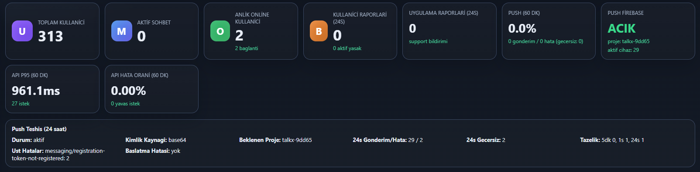
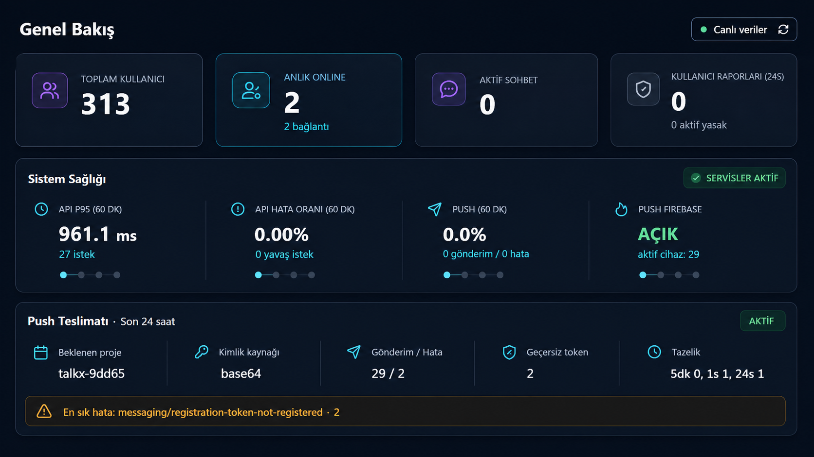
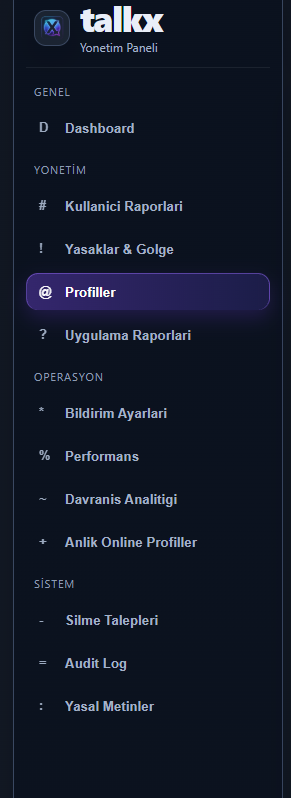
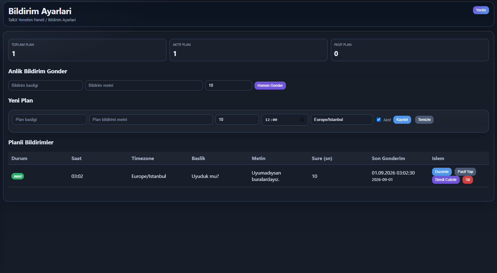
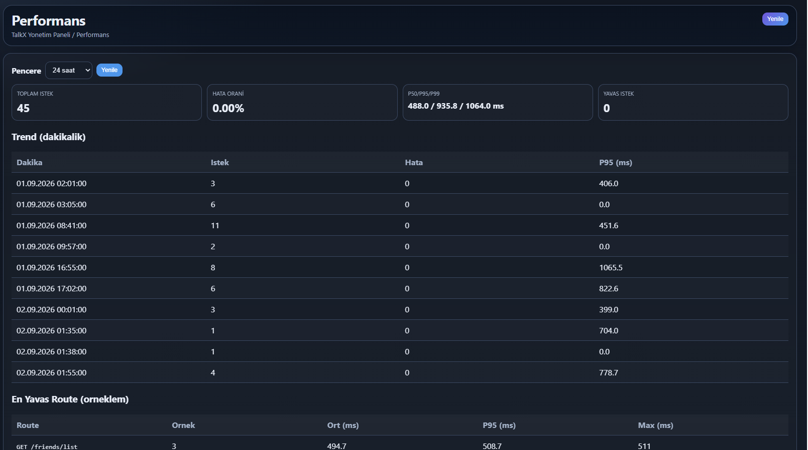
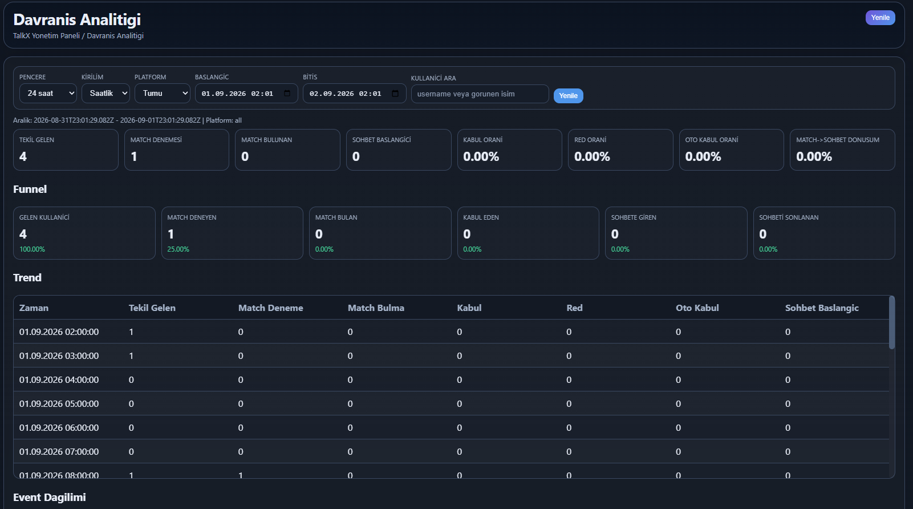
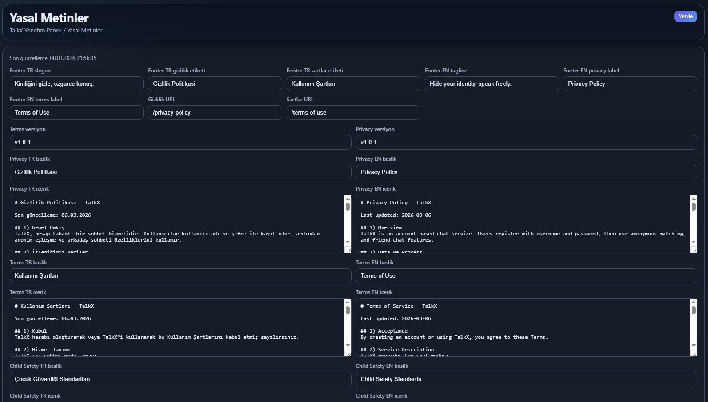

# TalkX Backend Yönetim Paneli Görsel İnceleme ve Revizyon Planı

Bu dosya, TalkX backend yönetim panelinin görsel ve bilgi mimarisi incelemesini tek yerde toplar. Amaç bu turda kod değiştirmek değil; ekranların mevcut durumunu, onaylanmış yönü, yapılacak işleri ve kapanış ölçütlerini netleştirmektir.

## İnceleme durumu

- **İnceleme tarihi:** 28 Eylül 2026
- **İncelenen dal:** `sale-release`
- **İncelenen backend commit:** `9ab004f`
- **Ana yüzey:** `admin.html`
- **Mevcut canlı ekran kanıtları:** 1–2 Eylül 2026 tarihli kalıcı QA görüntüleri
- **Güncel kod incelemesi:** 28 Eylül 2026 tarihli `admin.html`, `admin.js` ve ilgili admin API akışları
- **Durum:** Analiz tamamlandı, uygulama başlamadı
- **Kapsam:** Dashboard, navigasyon, profiller, moderasyon/raporlar, bildirimler, performans, davranış analitiği, online kullanıcılar, silme talepleri, audit ve yasal metinler

> Kanıt sınırı: Windows tarayıcı görüntü yakalama yardımcısı bu turda oturum başlatma hatası verdi. Bu nedenle ekran görüntüleri son saklanmış canlı QA kayıtlarıdır; güncel davranış ayrıca mevcut `sale-release` kodundan doğrulanmıştır. Yeni tasarım uygulandıktan sonra bütün görüntüler yeniden alınacaktır.

> Gizlilik sınırı: Kullanıcı adı, IP, cihaz kimliği veya rapor sahibine ait ayrıntı gösteren eski Profiller, Profil Detayı, Aktivite ve Rapor Detayı görüntüleri incelendi fakat backend reposuna kopyalanmadı. Yeni QA görüntüleri maskeli/sentetik veriyle üretilecektir.

## Yönetici özeti

Panel işlevsel ve veri açısından zengin; temel problem özellik eksikliği değil, bilgiyi önceliklendirme ve güvenli biçimde sunma sorunudur.

En kritik tespit, planlanan dashboard revizyonunun **yer değiştirme yerine ekleme** şeklinde uygulanmış olmasıdır. Eski dokuz kart ve Push Teşhis bloğu korunurken aynı sayfanın altına yeni `Satış Özeti` bölümü eklenmiştir. Böylece aynı veya yakın metrikler iki farklı özet katmanında tekrar eder, ekran uzar ve onaylanan `Genel Bakış → Sistem Sağlığı → Push Teslimatı` hiyerarşisi oluşmaz.

Panel genelinde görülen ortak sorunlar:

- aynı ağırlığa sahip çok fazla kart, tablo, buton ve ham veri,
- ekranlar arasında ortak bir başlık/özet/filtre/aksiyon düzeninin bulunmaması,
- noktalama veya harflerin ikon yerine kullanılması,
- riskli aksiyonların normal inceleme eylemleri kadar görünür olması,
- iç içe kaydırma alanları ve uzun masaüstü sayfaları,
- `0`, veri yok, loading, stale ve hata durumlarının yeterince ayrışmaması,
- hassas ve teknik bilginin varsayılan yüzeylerde gereğinden fazla görünmesi,
- mobilde sidebar'ın drawer olmak yerine içeriğin altına taşınması,
- yasal içerik gibi yüksek riskli işlemlerde taslak/yayın ayrımının görünmemesi.

## Ekran envanteri

| Alan | Mevcut durum | Öncelik | İnceleme kaydı |
|---|---|---:|---|
| Dashboard üst özet | Eski kartlar + yeni Satış Özeti birlikte; tekrar ve uzunluk var | P1 | `ADMIN-001` |
| Sistem sağlığı / Push | Ham teşhis bilgisi tek yoğun satır; durum eşikleri belirsiz | P1 | `ADMIN-002` |
| Sol navigasyon / mobil kabuk | 12 hedef aynı ağırlıkta; gerçek ikon ve mobil drawer yok | P1 | `ADMIN-003` |
| Ortak panel bileşenleri | Kart, tablo, modal, durum ve aksiyon dili parçalı | P1 | `ADMIN-004` |
| Profiller listesi | İyileştirme başlamış; yoğunluk, aksiyon ve gizlilik sorunları sürüyor | P1 | `ADMIN-005` |
| Profil detayı | Uzun modal ve teknik veri yığını; görev odaklı değil | P1 | `ADMIN-006` |
| Kullanıcı/Uygulama raporları ve yasaklar | İnceleme ve riskli aksiyonlar aynı yüzeyde; bağlam yetersiz | P1 | `ADMIN-007` |
| Bildirim ayarları | Tek dil, zayıf önizleme/etki özeti, sıkışık form | P1 | `ADMIN-008` |
| Performans | Ham tablo ağırlıklı; eşik, güven ve aksiyon özeti zayıf | P2 | `ADMIN-009` |
| Davranış analitiği | Çok sayıda KPI + ham tablo; yolculuk hikâyesi yok | P2 | `ADMIN-010` |
| Online/Silme/Audit | Farklı veri tabloları aynı genel kalıba sıkıştırılmış | P2 | `ADMIN-011` |
| Yasal metinler | Tek uzun canlı form; taslak, diff, önizleme ve güvenli yayın yok | P1 | `ADMIN-012` |

---

## ADMIN-001 — Dashboard hiyerarşisi planlandığı gibi uygulanmamış

- **Durum:** Bekliyor
- **Öncelik:** P1
- **Kapsam:** Dashboard ilk görünüm; masaüstü ve mobil

### Mevcut ekran kanıtı

### Onaylanan yön

### Tespit

Eski dashboard dokuz bağımsız kartı ve ayrı Push Teşhis alanını render etmeye devam ediyor. Güncel kod bunların altına ayrıca yedi metrikli `Satış Özeti` ekliyor. Bu nedenle revizyon eski yapıyı değiştirmiyor; üçüncü bir özet alanı ekleyerek tekrarı artırıyor.

Örnek tekrarlar:

- Toplam Kullanıcı hem üst kartta hem Satış Özeti'nde,
- Anlık Online hem üst kartta hem Satış Özeti'nde,
- Aktif Sohbet/Conversation hem üst kartta hem Satış Özeti'nde,
- Kullanıcı ve Uygulama Raporları farklı kart/özet kombinasyonlarında,
- zaman aralıkları ve veri kaynakları aynı ilk görünümde farklı anlatım biçimleriyle sunuluyor.

### Kararlaştırılan yön

Dashboard tek bir bilgi mimarisine taşınacak:

1. **Genel Bakış:** Toplam kullanıcı, anlık online, aktif sohbet ve dikkat bekleyen raporlar.
2. **Sistem Sağlığı:** API gecikmesi, hata oranı, push başarısı ve Firebase durumu.
3. **Push Teslimatı:** Son 24 saat özeti, geçersiz token ve baskın hata.
4. **Kullanıcı Aktivitesi:** Sınırlı KPI + okunabilir grafik.
5. **Dikkat Gerektirenler:** Gerçek problem/uyarılar; ham olay akışı değil.

`Satış Özeti` adı kullanıcıya dönük bir dashboard kavramı değildir; ürün/operasyon diliyle `Genel Bakış` olarak sunulmalıdır. Wave veya implementasyon terimleri (`Wave 14 minimal kapsam`) production panelinde görünmemelidir.

### Kabul kriterleri

- Aynı metrik ilk görünümde yalnızca bir kez görünür.
- Eski dokuz kart yapısı ve sonradan eklenen Satış Özeti tek bir hiyerarşide birleşir.
- Normal, uyarı, kritik, bilinmiyor ve stale durumları renk dışında ikon/metinle ayrılır.
- `0`, veri yok ve endpoint hatası birbirine karışmaz.
- Son başarılı yenileme ve kapsanan zaman aralığı görünür.
- Masaüstünde ana durum bir ekran içinde anlaşılır; mobilde tek kolon ve doğru öncelik korunur.
- Metrikler mevcut endpointlerle birebir uzlaştırılır; dekoratif/sahte trend üretilmez.

---

## ADMIN-002 — Sistem sağlığı ve Push Teşhis okunabilir bir karar alanı değil

- **Durum:** Bekliyor
- **Öncelik:** P1
- **Kapsam:** Dashboard; API ve push operasyon durumu

### Tespit

Push Teşhis bloğu proje, kimlik kaynağı, gönderim/hata, geçersiz token, tazelik ve hata kodunu tek yoğun satıra yayıyor. API P95 ve hata oranı kartları sayı gösterse de `iyi mi, kötü mü, ne yapmalıyım?` sorusunu cevaplamıyor.

### Kararlaştırılan yön

- Sistem Sağlığı tek bir bölüm olmalı; API, push ve Firebase alt sinyalleri aynı durum sözleşmesini kullanmalı.
- Toplu sağlık etiketi yalnız gerçek eşiklerden türetilmeli.
- Push Teslimatı kendi sakin kartında özetlenmeli; baskın hata varsa uyarı bandı, yoksa sade `Hata yok` durumu kullanılmalı.
- Teknik proje/credential ayrıntısı varsayılan özetten çıkarılıp `Kanıtı gör` katmanına taşınmalı.

### Kabul kriterleri

- API P95/hata oranı için belgelenmiş iyi–uyarı–kritik eşikleri bulunur.
- Firebase kapalı veya endpoint hatalıyken toplu durum koşulsuz yeşil görünmez.
- Uzun hata kodu taşmaz; adet ve zaman penceresiyle gösterilir.
- Kısmi endpoint hatasında sağlam metrikler görünmeye devam eder, problemli alan tekrar denenebilir.

---

## ADMIN-003 — Navigasyon gerçek bir yönetim kabuğuna dönüşmeli

- **Durum:** Bekliyor
- **Öncelik:** P1
- **Kapsam:** Sol navigasyon, topbar, mobil/dar ekran

### Mevcut ekran kanıtı

### Tespit

Panel 12 hedefi dört grupta aynı ağırlıkla gösteriyor. `D`, `#`, `!`, `@`, `?`, `*`, `%`, `~`, `+`, `-`, `=` ve `:` karakterleri ikon gibi kullanılıyor. Mevcut responsive CSS 1180 px altında sidebar'ı drawer yapmak yerine ana içeriğin altına taşıyor; bu mobil yönetim deneyimi için doğru bir navigasyon modeli değil.

Sidebar'daki `Tüm Verileri Yenile` ve topbar'daki `Yenile` kapsamı açık olmayan tekrar aksiyonlarıdır.

### Kararlaştırılan yön

- Gerçek ve tutarlı bir SVG ikon ailesi kullanılacak.
- Bilgi mimarisi görev odaklı olacak:
  - Genel Bakış
  - Kullanıcılar ve Moderasyon
  - Operasyon
  - Analiz ve Sistem
- En sık kullanılan 4–6 hedef ilk bakışta bulunacak; ikincil hedefler daraltılabilir gruplarda kalacak.
- Mobilde sidebar, odak kilidi ve Escape desteği olan drawer'a dönüşecek.
- Refresh aksiyonlarının kapsamı birleştirilecek veya açıkça ayrıştırılacak.

### Kabul kriterleri

- Noktalama/harf ikon kalmaz.
- Aktif sayfa `aria-current`, metin, ikon ve görsel vurgu ile anlaşılır.
- Bekleyen rapor/silme talebi gibi gerçek işlerde veri tabanlı rozet kullanılabilir.
- Mobil drawer açılma/kapanma, odak, arka plan scroll kilidi ve klavye testini geçer.
- Yenileme, geri/ileri ve doğrudan sayfa açma davranışı tahmin edilebilir olur.

---

## ADMIN-004 — Ortak admin tasarım sistemi ve durum sözleşmesi eksik

- **Durum:** Bekliyor
- **Öncelik:** P1
- **Kapsam:** Bütün admin ekranları

### Tespit

Tek dosyalı `admin.html` içinde birçok ekran aynı genel `.card`, `.panel`, `table`, `.modal` ve `.btn` sınıflarını paylaşsa da görev türüne göre bileşen sözleşmesi yoktur. Bazı ekranlar kart, bazıları ham tablo, bazıları uzun form olarak görünür; başlık, açıklama, filtre, veri tazeliği ve ana aksiyon düzeni tutarlı değildir.

### Kararlaştırılan yön

Kodlamadan önce küçük bir admin UI sözleşmesi oluşturulacak:

- sayfa başlığı + amaç + son yenileme + ana aksiyon,
- özet kartı,
- durum bandı,
- filtre çubuğu,
- veri tablosu,
- empty/loading/error/stale/partial durumları,
- güvenli detay drawer'ı,
- normal ve riskli aksiyon menüsü,
- onay modalı,
- toast + kalıcı sonuç satırı.

### Kabul kriterleri

- Bütün ekranlar ortak spacing, radius, tipografi, ikon, buton ve durum tokenlarını kullanır.
- Riskli eylemler normal navigasyon/inceleme eylemlerinden ayrılır.
- Loading, empty, error, partial ve stale durumları her ekranda aynı anlama gelir.
- Uzun TR/EN metin, yüzde 200 zoom, 320 px ekran ve klavye kullanımı ortak QA matrisinden geçer.

---

## ADMIN-005 — Profiller listesi sakin, okunabilir ve gizlilik kontrollü olmalı

- **Durum:** Kısmen uygulanmış, revizyon bekliyor
- **Öncelik:** P1
- **Kapsam:** Profiller listesi, arama, filtre, sıralama, toplu seçim
- **Kanıt:** Kısıtlı canlı kanıt incelendi; kullanıcı/IP içerdiği için bu pakete kopyalanmadı.

### Tespit

Güncel kod eski sekiz kolonlu yapıyı beş ana kolona indirerek doğru yönde ilerlemiş: Kullanıcı, Durum, Konum, Aktivite ve İşlem. Buna rağmen:

- genel tablo `table-layout: fixed` ve global `word-break` kullanıyor,
- filtreleme yalnız metin araması ve sınırlı sıralamaya dayanıyor,
- toplu moderasyon araçları normal inceleme alanıyla aynı görsel düzlemde,
- geo kaynak/kalite bilgisi konumla aynı hücrede teknik gürültü oluşturuyor,
- hassas verinin yetki, maskeleme ve audit modeli görsel olarak anlaşılmıyor.

### Kararlaştırılan yön

- Güçlü bir kimlik hücresi: kullanıcı adı, görünen isim, platform ve hesap durumu.
- Konum ve aktivite ikincil hiyerarşide; geo kalite/kaynak ayrıntıda.
- Filtreler: durum/ban, platform, ülke, online/son görülme.
- Toplu işlem çubuğu yalnız seçim yapıldığında açılır.
- Riskli eylemler satırdaki kırmızı butonlar yerine bağlamsal menü/detay alanına taşınır.
- Hassas alanlar maskeli; tam değer yalnız gerekli yetki ve auditli eylemle açılır.

### Kabul kriterleri

- Uzun kullanıcı adı, konum ve tarih rastgele ortadan bölünmez.
- Arama temizleme, sonuç sayısı, filtre özeti ve pagination açıktır.
- Seçim sayfa değişiminde nasıl davranacağını açıkça belirtir.
- Ban/gölge/unban onayı hedef sayısı, süre, gerekçe ve etkiyi gösterir.
- Mobilde kart satırı veya öncelikli kolon modeli kullanılır; kontrolsüz yatay taşma olmaz.

---

## ADMIN-006 — Profil detayı uzun ham modal olmaktan çıkmalı

- **Durum:** Kısmen uygulanmış, revizyon bekliyor
- **Öncelik:** P1
- **Kapsam:** Profil Detayı, ilişkiler, oturum/cihaz, moderasyon
- **Kanıt:** Kısıtlı canlı kanıt incelendi; kişisel/teknik tanımlayıcı içerdiği için bu pakete kopyalanmadı.

### Tespit

Güncel kod profil özetini, moderasyonu, ilişkileri ve teknik kanıtı bölümlere ayırmaya başlamış olsa da yüzey hâlâ uzun bir modal içinde toplanıyor. Yönetici `Bu kullanıcıda sorun ne, son durum ne, hangi aksiyon güvenli?` sorularının cevabını ilk bakışta alamıyor.

### Kararlaştırılan yön

- Büyük responsive drawer veya tam sayfa detay kullanılacak.
- Sticky profil özeti: kimlik, hesap durumu, son aktivite, ana risk ve ana aksiyon.
- Sekmeler/bölümler: Özet, Moderasyon, Oturumlar & Cihazlar, İlişkiler, Yasal & Konum, Teknik Kanıt.
- Alınan/gönderilen raporlar profil moderasyon bağlamına bağlanacak.
- Tam IP/device ID varsayılan görünümden çıkarılacak.

### Kabul kriterleri

- Ana durum ve risk beş saniye içinde bulunabilir.
- Her bölüm bağımsız loading/error/empty durumuna sahiptir.
- Teknik kanıt varsayılan kapalıdır ve hassas veriyi maskeler.
- Arkadaş ekleme, ban ve diğer yazma eylemleri sonuç/audit bilgisi gösterir.
- Modal/drawer mobilde taşmaz; başlık ve ana aksiyonlar erişilebilir kalır.

---

## ADMIN-007 — Rapor ve moderasyon ekranları tek bir vaka akışı kullanmalı

- **Durum:** Bekliyor
- **Öncelik:** P1
- **Kapsam:** Kullanıcı Raporları, Uygulama Raporları, Yasaklar & Gölge
- **Kanıt:** Rapor detayı canlı kanıtı incelendi; IP ve kullanıcı bilgisi içerdiği için bu pakete kopyalanmadı.

### Tespit

Kullanıcı raporlarında 24s, kalıcı ve gölge ban aksiyonları doğrudan tablo satırında yer alıyor. Uygulama raporu detayı çok sayıda teknik alanı eşit ağırlıkta gösteriyor. Vaka özeti, tekrar/etki, sahiplik, geçmiş, kanıt ve önerilen aksiyon tek bir hikâyeye dönüşmüyor.

### Kararlaştırılan yön

- Rapor listesi `Sorun → Etki/Tekrar → Durum/Sahip → Son güncelleme → Detay` hiyerarşisiyle okunacak.
- Detay drawer'ı vaka özeti, kullanıcı etkisi, ortam, kanıt, geçmiş ve aksiyon alanlarına ayrılacak.
- Ban gibi riskli aksiyonlar yalnız detay bağlamında, gerekçe ve onayla çalışacak.
- Yasaklar ekranı aktif/geçmiş durum, süre, gerekçe ve kaldırma etkisini net gösterecek.

### Kabul kriterleri

- Yönetici raporun önemini ham metadata okumadan anlayabilir.
- Tekrar eden raporlar gruplanır; ilgili kullanıcı/profil bağlamına geçiş vardır.
- Kanıt yok, eksik, saklama süresi dolmuş ve erişim hatası ayrışır.
- Bütün mutasyonlar audit sonucu ve kalıcı başarı/hata geri bildirimi üretir.

---

## ADMIN-008 — Bildirim ekranı kampanya bestecisine dönüşmeli

- **Durum:** Bekliyor
- **Öncelik:** P1
- **Kapsam:** Anlık bildirim, planlama, hedef/dil, önizleme

### Mevcut ekran kanıtı

### Tespit

Form alanları geniş ekrana tek satır halinde yayılıyor; etiketler büyük ölçüde placeholder'a bırakılmış. Anlık bildirim ve yeni plan akışlarında hedef kitle, TR/EN varyantları, gerçek alıcı sayısı, cihaz önizlemesi ve gönderim etkisi görünmüyor. `Hemen Gönder`, `Şimdi Çalıştır` ve `Sil` gibi güçlü eylemler küçük ve birbirine yakın butonlardır.

### Kararlaştırılan yön

- Akış üç adıma ayrılacak: İçerik → Hedef ve zaman → Önizleme/onay.
- TR ve EN varyantları ile fallback kararı görünür olacak.
- Tahmini alıcı, uygun cihaz, geçersiz token ve hedef özeti onay öncesinde gösterilecek.
- Telefon içi önizleme ve uzun metin/emoji kontrolü bulunacak.
- Planlı bildirimler sakin kart/liste halinde; durum ve sonraki çalışma zamanı öncelikli sunulacak.

### Kabul kriterleri

- Placeholder tek başına alan etiketi değildir.
- Gönderimden önce içerik, dil, hedef, alıcı sayısı ve zaman açıkça onaylanır.
- Büyük gönderim, çift tıklama ve kısmi provider hatası güvenli biçimde ele alınır.
- Audit özeti içerik hash'i, hedef, dil, alıcı sonucu ve admini korur; token içermez.

---

## ADMIN-009 — Performans ekranı ham telemetry tablosu değil operasyon özeti olmalı

- **Durum:** Bekliyor
- **Öncelik:** P2
- **Kapsam:** Performans sekmesi

### Mevcut ekran kanıtı

### Tespit

P50/P95/P99 aynı satırda teknik bir dizi olarak sunuluyor; yavaş istek eşiği ve metrik güveni görünmüyor. Dakikalık trend tablo olarak ana yüzeyde yer kaplıyor. `0 yavaş istek`, P95 yüksek olduğunda bile yanlış biçimde `sorun yok` izlenimi verebilir.

### Kararlaştırılan yön

- Üstte net sağlık özeti: durum, etki, güven ve zaman penceresi.
- Gecikme ve hata trendi gerçek grafikle gösterilecek.
- En fazla etkilenen route'lar trafik + hata + gecikme birlikte değerlendirilerek sıralanacak.
- Dakikalık ham kayıtlar `Teknik kanıt` bölümüne taşınacak.

### Kabul kriterleri

- Yavaş istek eşiği görünür ve backend sözleşmesiyle aynıdır.
- Örnek az, veri yok ve gerçek sıfır ayrıdır.
- Önceki dönem karşılaştırması yalnız yeterli veri varsa gösterilir.
- Sorun kartı ne olduğu, etkisi ve incelenecek route'u tek bakışta verir.

---

## ADMIN-010 — Davranış analitiği olay tablosundan kullanıcı yolculuğuna geçmeli

- **Durum:** Bekliyor
- **Öncelik:** P2
- **Kapsam:** Davranış Analitiği ve Dashboard aktivite alanı

### Mevcut ekran kanıtı

### Tespit

Ekran çok sayıda KPI, bağımsız funnel sayıları ve saatlik ham tabloyu aynı seviyede gösteriyor. Match ve sohbet sayıları benzersiz yolculuk kimliği yerine event toplamlarından okunursa çift sayım riski oluşur. `Nerede kaybediyoruz ve örnek bir yolculukta ne oldu?` sorusu ham event taraması gerektiriyor.

### Kararlaştırılan yön

- Ordered funnel: gelen → arama → teklif → karar → conversation → sohbet.
- Match/conversation kimliğiyle gruplanmış yolculuk hikâyeleri.
- Ana trend alanı yalnız anlamlı hacim, dönüşüm, drop ve anomaliyi gösterir.
- Event dağılımı ve ham kayıtlar gelişmiş kanıt katmanına taşınır.
- Dashboard Son Aktiviteler listesi kısa, gruplanmış ve tek dilde olur; iç scroll kaldırılır.

### Kabul kriterleri

- Tek gerçek match/chat bir kez sayılır.
- En büyük drop, veri güveni ve önceki dönem farkı beş saniyede bulunabilir.
- Match veya conversation aranarak ilgili hikâyeye tek adımda gidilir.
- Düşük örnek, eksik telemetry ve pencereyi aşan yolculuklar açıkça işaretlenir.

---

## ADMIN-011 — Online, Silme Talepleri ve Audit görevlerine özel yüzeyler olmalı

- **Durum:** Bekliyor
- **Öncelik:** P2
- **Kapsam:** Anlık Online Profiller, Silme Talepleri, Audit Log

### Tespit

Bu ekranlar ortak tablo kalıbıyla işlev görüyor ancak görevleri farklıdır:

- Online kullanıcı ekranı gerçek zamanlı operasyon görünümüdür.
- Silme talepleri son tarih ve iş akışı riski taşır.
- Audit kanıt ve iz sürme ekranıdır.

Hepsini aynı tablo görsel ağırlığıyla sunmak öncelik ve aksiyon dilini zayıflatır.

### Kararlaştırılan yön

- Online: anlık sayaç, bağlantı süresi, platform/dil, kontrollü otomatik yenileme ve stale göstergesi.
- Silme talepleri: durum kolonları, son tarih/yaş, işleme sahibi, güvenli ayrıntı ve terminal sonuç.
- Audit: aktör, eylem, hedef, sonuç, zaman filtreleri ve açılır sanitize kanıt.

### Kabul kriterleri

- Otomatik yenileme odağı veya satır seçimini bozmaz.
- Silme talebi gecikme/başarısızlık riski özetlenir.
- Audit varsayılan listede hassas payload göstermez; filtreleme ve kanıt ilişkisi korunur.

---

## ADMIN-012 — Yasal Metinler güvenli yayın merkezi olmalı

- **Durum:** Bekliyor
- **Öncelik:** P1
- **Kapsam:** Privacy, Terms, Child Safety, footer/linkler ve yayın akışı

### Mevcut ekran kanıtı

### Tespit

Footer alanları, iki sürüm ve üç belgenin TR/EN başlık/içerikleri tek uzun formda aynı anda açılıyor. Altı uzun textarea ve çok sayıda input arasında belge durumu kayboluyor. Tek `Kaydet` eylemi canlı kaydı güncelliyor; taslak, diff, son kullanıcı önizlemesi, yayın geçmişi ve geri alma görünmüyor.

Bu yalnız görsel bir sorun değildir. Terms/Privacy sürümü değişirse kullanıcıların yeniden kabul akışı etkilenebilir; metin değişip sürüm aynı kalırsa mevcut kabul geçerli kalır. Panel bu kararın etkisini göstermiyor.

### Kararlaştırılan yön

- Varsayılan ekran editör değil belge yayın özeti olacak.
- Privacy, Terms, Child Safety ve Footer/Linkler ayrı kartlar halinde durum gösterecek.
- Bir seferde yalnız seçilen belge düzenlenecek; TR/EN sekme veya kontrollü karşılaştırma kullanılacak.
- `Taslağı Kaydet` ile `Yayınla` ayrılacak.
- Yayın öncesi diff, gerekçe, sürüm/reaccept etkisi ve son kullanıcı önizlemesi gösterilecek.
- Her yayın değişmez snapshot ve audit kaydı oluşturacak; rollback yeni yayın olayı olacak.

### Kabul kriterleri

- Yönetici üç belgenin yayın/taslak/eksik durumunu beş saniyede görür.
- Kaydet canlı içeriği değiştirmez; yayın ayrı onay akışıdır.
- Maddi değişiklikte sürüm/reaccept etkisi hesaplanır ve unutulamaz.
- TR/EN eksikliği, placeholder, limit, URL ve güvensiz içerik alan bazında gösterilir.
- Public API, web LegalScreen, footer ve kabul modali aynı yayın/sürümü doğrular.
- Eşzamanlı editör conflict'i eski sayfanın yeni yayını ezmesini engeller.

---

## Ortak responsive ve erişilebilirlik kontrolü

Her ekran için aşağıdaki durumlar ayrı kabul kriteridir:

- 320–390 px mobil,
- tablet/dar masaüstü,
- 1440 px ve geniş masaüstü,
- yüzde 200 browser zoom,
- yalnız klavye kullanımı,
- görünür focus ve anlamlı tab sırası,
- ekran okuyucu etiketi ve `aria-current`/`aria-sort`,
- en az 44×44 px kritik dokunma alanı,
- uzun Türkçe/İngilizce metin,
- loading, empty, gerçek sıfır, error, partial ve stale veri,
- yavaş ağda tekrar tıklama ve eski verinin yanlışlıkla canlı görünmemesi.

## Uygulama sırası

Bu sıra aynı anda her ekranı değiştirmek yerine ortak temeli kurup riski kontrollü ilerletir:

1. [ ] **ADM-00 — Tasarım temeli:** Ortak token, ikon ailesi, sayfa başlığı, durum bandı, filtre, tablo, drawer ve onay kalıpları.
2. [ ] **ADM-01 — Kabuk ve navigasyon:** Sidebar bilgi mimarisi, topbar, gerçek ikonlar ve mobil drawer.
3. [ ] **ADM-02 — Dashboard:** Eski/yeniden eklenen özetleri birleştir; onaylı Genel Bakış, Sistem Sağlığı ve Push Teslimatı yönünü uygula.
4. [ ] **ADM-03 — Ortak tablo/aksiyon sistemi:** Okunabilir satırlar, filtre/pagination, bağlamsal ve riskli aksiyon desenleri.
5. [ ] **ADM-04 — Profiller:** Liste, filtreler, gizlilik ve responsive profil detayı.
6. [ ] **ADM-05 — Moderasyon:** Kullanıcı raporları, uygulama raporları ve yasakları vaka akışında birleştir.
7. [ ] **ADM-06 — Bildirimler:** TR/EN içerik, hedef, zaman, önizleme, alıcı özeti ve güvenli onay.
8. [ ] **ADM-07 — Performans:** Sağlık özeti, gerçek trend, route etkisi ve teknik kanıt katmanı.
9. [ ] **ADM-08 — Davranış analitiği:** Ordered funnel, yolculuk hikâyeleri ve ham kanıt ayrımı.
10. [ ] **ADM-09 — Yasal yayın merkezi:** Belge özeti, taslak, diff, etki, yayın ve geçmiş.
11. [ ] **ADM-10 — Kalan operasyon ekranları:** Online, silme talepleri ve audit.
12. [ ] **ADM-11 — Kapanış QA:** Masaüstü/mobil görseller, erişilebilirlik, API karşılaştırması ve regresyon.

## Kodlama öncesi üç görsel referans

Uygulamaya başlamadan önce bütün ekranlar için ayrı ayrı mockup üretmek gerekmiyor. Üç referans aile yeterli olacaktır:

1. **Admin kabuğu + Dashboard:** Mevcut onaylı dashboard yönü güncel sidebar/topbar ile tamamlanır.
2. **Yoğun veri ekranı:** Profiller/Raporlar için tablo + filtre + detay drawer referansı.
3. **Form/yayın ekranı:** Bildirimler/Yasal Metinler için adımlı besteci + önizleme + onay referansı.

Bu üç yön onaylandıktan sonra ortak bileşenlerle diğer ekranlara tutarlı biçimde uygulanacaktır.

## Uygulama dışı kalan kararlar

Görsel revizyon sırasında aşağıdaki davranışlar ayrıca backend/veri işi olarak ele alınmalıdır; CSS ile çözülmüş sayılmaz:

- bildirim hedefleme, dil varyantı ve alıcı sayımı,
- yasal içerik taslak/yayın/snapshot/rollback modeli,
- rol bazlı hassas veri açma ve audit,
- ordered funnel ve benzersiz match/conversation sayımı,
- sağlık eşikleri ve güven/no-data sözleşmesi.

## Kapanış checklist'i

### Genel kabuk

- [ ] Gerçek ikonlar ve görev odaklı navigasyon kullanılıyor.
- [ ] Mobil drawer, klavye ve focus davranışı doğru.
- [ ] Tek ve anlaşılır yenileme davranışı var.
- [ ] Ortak loading/empty/error/stale/partial durumları uygulanmış.

### Dashboard

- [ ] Aynı metrik iki ayrı özet bölümünde tekrarlanmıyor.
- [ ] Genel Bakış, Sistem Sağlığı ve Push Teslimatı ayrışıyor.
- [ ] Durum ve eşikler gerçek veriden türetiliyor.
- [ ] İlk görünümde ana durum ve dikkat gereken sorun anlaşılabiliyor.

### Veri ve moderasyon

- [ ] Profiller ve rapor tabloları kolay taranıyor.
- [ ] Hassas alanlar varsayılan olarak maskeli.
- [ ] Riskli aksiyonlar bağlamsal ve onaylı.
- [ ] Detay drawer'ları görev odaklı ve responsive.

### Operasyon ve içerik

- [ ] Bildirimlerde dil, hedef, alıcı ve önizleme açık.
- [ ] Performans/analitik özetleri ham tablodan önce geliyor.
- [ ] Yasal içerikte taslak ve yayın birbirinden ayrı.
- [ ] Online, silme ve audit ekranları görevlerine uygun bilgi hiyerarşisi kullanıyor.

### Son doğrulama

- [ ] Bütün endpoint değerleri ekrandaki değerlerle karşılaştırıldı.
- [ ] Masaüstü, dar ekran ve mobil ekran görüntüleri yenilendi.
- [ ] Klavye, yüzde 200 zoom ve uzun metin QA'i geçti.
- [ ] Tarayıcı konsolunda yeni hata yok.
- [ ] Riskli admin işlemleri test verisiyle ve audit kanıtıyla doğrulandı.

## Kod referansları

- `admin.html`: panel kabuğu, navigasyon, dashboard, tablolar, modallar ve ekran render fonksiyonları
- `admin.js`: admin API'leri, moderasyon, rapor, profil, performans, analitik, bildirim ve yasal içerik işlemleri
- `utils/adminSecurity.js`: admin erişim ve güvenlik kuralları
- `utils/adminOperationsContract.js`: operasyon sözleşmeleri
- `test/wave15-admin-operations.test.js`: mevcut admin operasyon regresyonları

