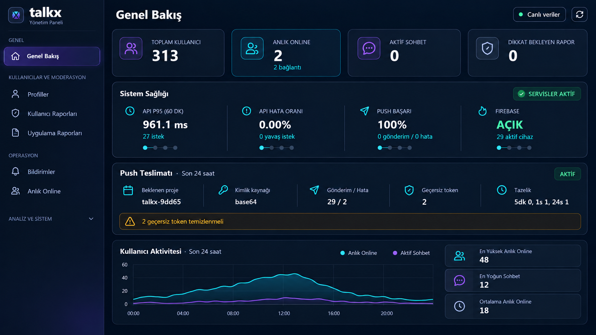
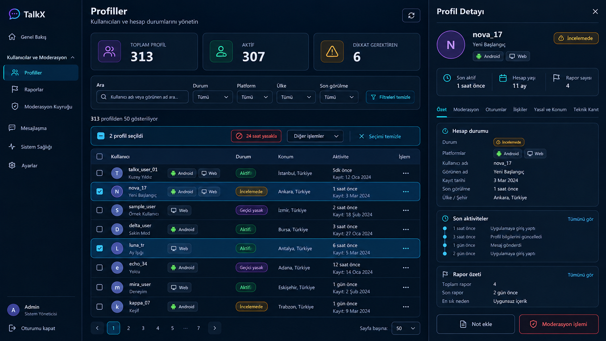
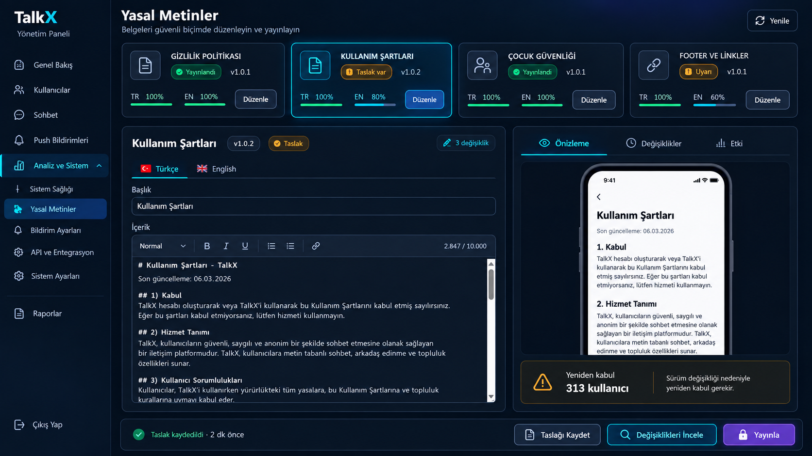

# TalkX Admin UI Foundation

Bu sözleşme, yönetim paneli revizyonunda kullanılacak ortak görsel ve davranış sistemini tanımlar. Referans mockup'lar yön gösterir; kod bu kurallarla tekrar kullanılabilir bileşenler hâlinde uygulanır.

## Durum

- **Tarih:** 29 Eylül 2026
- **Kapsam:** Kodlama öncesi tasarım sözleşmesi
- **Uygulama:** Başlamadı
- **Referanslar:**
  - `assets/admin-shell-dashboard-reference-v1.png`
  - `assets/data-management-reference-v1.png`
  - `assets/form-publishing-reference-v1.png`

## 1. Tasarım ilkeleri

1. **Özet önce, kanıt isteğe bağlı:** İlk görünüm karar vermeyi sağlar; ham teknik ayrıntı açılır katmanda kalır.
2. **Bir metrik, bir otorite:** Aynı değer aynı ekranda farklı kartlarda tekrarlanmaz.
3. **Durum dürüstlüğü:** Gerçek sıfır, veri yok, yükleniyor, stale, kısmi hata ve tam hata birbirinden ayrılır.
4. **Risk bağlam içinde:** Ban, silme, yayınlama ve toplu gönderim normal inceleme eylemleriyle aynı ağırlıkta durmaz.
5. **Hassas veri varsayılan kapalı:** IP, cihaz kimliği, token ve ham metadata maskeli veya teknik kanıt katmanındadır.
6. **Tek görsel dil:** Dashboard, tablo, form, drawer ve modal aynı token/ikon/durum sistemini kullanır.
7. **Mobil sonradan eklenmez:** Bileşenler başlangıçtan itibaren 320 px–geniş masaüstü aralığında tasarlanır.

## 2. Renk rolleri

Nihai değerler CSS tokenı olarak tek yerde tutulacaktır. Aşağıdaki değerler V1 başlangıç paletidir:

| Token | Değer | Rol |
|---|---:|---|
| `--admin-bg` | `#07111f` | Ana arka plan |
| `--admin-bg-deep` | `#040b15` | Sidebar/derin zemin |
| `--admin-surface` | `#0d1929` | Panel ve kart |
| `--admin-surface-raised` | `#122238` | Drawer/modal/yükseltilmiş yüzey |
| `--admin-border` | `rgba(126, 164, 211, .28)` | Standart ayırıcı |
| `--admin-border-strong` | `rgba(126, 180, 235, .46)` | Aktif/odak sınırı |
| `--admin-text` | `#f3f7ff` | Ana metin |
| `--admin-muted` | `#9eafc7` | İkincil metin |
| `--admin-cyan` | `#16dff3` | Canlı, seçili, bilgi |
| `--admin-purple` | `#8b5cf6` | Marka ve yayın aksiyonu |
| `--admin-success` | `#42d392` | Sağlıklı/başarılı |
| `--admin-warning` | `#f3b84b` | Dikkat/stale |
| `--admin-danger` | `#ff5f78` | Kritik ve yıkıcı işlem |

Kurallar:

- Durum yalnız renkle anlatılmaz; ikon ve metin zorunludur.
- Neon glow, aktif seçim veya küçük vurgu için kullanılır; her kartın arkasına uygulanmaz.
- Tehlike rengi yalnız kritik veri veya riskli eylem içindir.
- Metin/zemin kontrastı normal metinde en az WCAG AA seviyesini hedefler.

## 3. Ölçü ve tipografi

### Spacing

- Temel ölçek: `4, 8, 12, 16, 24, 32px`
- Kart iç boşluğu: masaüstü `20–24px`, mobil `16px`
- Bölüm aralığı: `24px`
- Form alanı aralığı: `12–16px`

### Radius

- Input/buton: `10px`
- İç kart: `14px`
- Ana panel/drawer: `18px`
- Pill/badge: `999px`

### Tipografi

- Uygulama fontu mevcut sistem font zinciriyle devam edebilir; bütün panelde tek zincir kullanılmalıdır.
- Sayfa başlığı: `28–32px / 700`
- Bölüm başlığı: `20–24px / 700`
- Kart değeri: `32–40px / 700`
- Gövde: `14–16px`
- Yardımcı metin: minimum `12px`; kritik açıklama 12px altına düşmez.
- Uppercase yalnız kısa metrik etiketlerinde kullanılır.

## 4. Yerleşim sistemi

### Masaüstü

- Sidebar: yaklaşık `232px`, viewport boyunca sabit/sticky.
- İçerik: kalan alan; kontrollü maksimum satır uzunluğu ve 24px dış boşluk.
- Topbar: sayfa başlığı, açıklama, son yenileme ve tek ana aksiyon.
- Dashboard: 4 ana kart; alt bölümler tam genişlikte veya anlamlı iki kolon.

### Tablet / dar masaüstü

- 1180px altında dashboard grid iki/tek kolona iner.
- Sidebar içeriğin altına taşınmaz; kompakt drawer/toggle modeline geçer.
- Filtreler satır kırabilir; ana aksiyon görünür kalır.

### Mobil

- Sidebar tam yükseklik drawer olur.
- Drawer açıldığında arka plan scroll kilitlenir ve odak içeride tutulur.
- Veri tablosu kör yatay scroll yerine öncelikli kolon veya kart satırı kullanır.
- Detay drawer'ı tam ekran sheet'e dönüşür.
- Sticky aksiyon alanı içeriği kapatmaz.

## 5. İkon sistemi

- Noktalama, harf ve emoji ikon olarak kullanılmaz.
- Tek tip outline SVG ailesi kullanılır; önerilen ölçü `18–20px`, stroke `1.75–2px`.
- İkonlar repo içi SVG map/component ile sunulur; yalnız ikon eklemek için yeni runtime bağımlılığı zorunlu değildir.
- İkon tek başına anlam taşımıyorsa görünür metin veya erişilebilir isimle birlikte kullanılır.
- Kritik eylemlerde renk + ikon + fiil birlikte bulunur.

## 6. Ortak sayfa sözleşmesi

Her admin sayfası şu sırayı kullanır:

1. Sayfa başlığı ve tek cümle amaç.
2. Son başarılı yenileme / veri tazeliği.
3. Gerekliyse 2–4 karar kartı.
4. Filtre veya kapsam kontrolü.
5. Ana çalışma yüzeyi.
6. İsteğe bağlı teknik kanıt.
7. Kalıcı başarı/hata sonucu.

`Wave`, tablo adı, endpoint adı ve implementation notu production başlıklarında gösterilmez.

## 7. Durum sözleşmesi

| Durum | Gösterim | Davranış |
|---|---|---|
| Loading | Skeleton + kısa etiket | Eski canlı değer gibi gösterilmez |
| Empty | Neden + uygulanabilir sonraki adım | `0` ile karışmaz |
| Zero | Gerçek `0` + zaman aralığı | Empty gibi yorumlanmaz |
| Partial | Sağlam veri görünür + problemli alan uyarılı | Bütün ekran kapanmaz |
| Stale | Son başarılı zaman + uyarı | Canlı etiketi kullanılmaz |
| Error | İnsan dili + tekrar dene | Ham stack/backend mesajı gösterilmez |
| Success | Kısa sonuç + gerekiyorsa audit referansı | Yalnız geçici toast'a bırakılmaz |

## 8. Bileşen sözleşmeleri

### Özet kartı

- Tek ana sayı/durum.
- Açık zaman penceresi veya kaynak güveni.
- En fazla bir ikincil satır.
- Dekoratif trend yalnız gerçek zaman serisi varsa.

### Durum bandı

- Normal, uyarı, kritik, bilinmiyor varyantları.
- `Ne oldu`, `etki`, `sonraki aksiyon` sırası.

### Filtre çubuğu

- Her alanın görünür etiketi bulunur.
- Aktif filtre özeti ve temizleme eylemi vardır.
- Yenileme filtreleri gereksiz yere sıfırlamaz.

### Veri tablosu

- Güçlü kimlik/ana konu hücresi.
- Satır/kolon takibi için sakin ayırıcı ve hover/focus.
- Metin rastgele ortadan bölünmez.
- Sort durumu ikon + `aria-sort` ile gösterilir.
- Sonuç sayısı, sayfa aralığı ve sayfa boyutu görünürdür.
- Riskli eylem her satırda baskın kırmızı buton değildir.

### Detay drawer'ı

- Masaüstünde `min(620px, 42vw)`; mobilde tam ekran.
- Sticky başlık/kimlik özeti ve kapatma eylemi.
- Görev odaklı sekmeler.
- Her bölüm bağımsız loading/error/empty durumu.
- Teknik kanıt varsayılan kapalı.

### Form / besteci

- Placeholder alan etiketi yerine geçmez.
- İçerik, hedef/etki ve önizleme birbirinden ayrılır.
- Kaydedilmemiş değişiklik görünürdür.
- Taslak kaydı ve canlı yayın/gönderim ayrı eylemlerdir.
- Alan bazlı hata ve karakter sayacı bulunur.

### Riskli işlem onayı

- Hedef, adet, süre, gerekçe, etki ve geri dönüş durumu gösterilir.
- Buton fiil içerir: `313 kullanıcıya gönder`, `24 saat yasakla`, `v1.0.2 yayınla`.
- Çift gönderim/tıklama engellenir.
- Sonuç audit bilgisiyle kalıcı olarak görünür.

## 9. Referans eşlemesi

### Admin kabuğu + Dashboard

Kullanılacağı alanlar: sidebar, topbar, dashboard, sistem sağlığı, push teslimatı ve aktivite özeti.

### Yoğun veri + detay

Kullanılacağı alanlar: Profiller, Kullanıcı Raporları, Uygulama Raporları, Yasaklar, Silme Talepleri ve Audit.

### Form + önizleme + yayın

Kullanılacağı alanlar: Yasal Metinler ve Bildirimler. Bildirim ekranında belge önizlemesi yerine cihaz bildirimi önizlemesi; sürüm etkisi yerine hedef/alıcı etkisi gösterilir.

## 10. Uygulama sınırları

Görsel referanslar aşağıdaki davranışları kendiliğinden çözmez; backend/veri sözleşmesiyle birlikte uygulanmalıdır:

- bildirim TR/EN varyantı, hedefleme ve alıcı sayımı,
- legal taslak/yayın/snapshot/rollback,
- rol bazlı hassas veri gösterimi ve audit,
- ordered funnel ve benzersiz journey sayımı,
- sağlık eşikleri, confidence ve no-data semantiği.

## 11. Kodlama öncesi Definition of Ready

- [x] Panel ekran envanteri ve bulgular tamamlandı.
- [x] Uygulama sırası ve kabul kriterleri yazıldı.
- [x] Admin kabuğu + Dashboard referansı üretildi.
- [x] Yoğun veri + detay drawer referansı üretildi.
- [x] Form + yayın referansı üretildi.
- [x] Ortak token, bileşen, durum ve responsive sözleşmesi yazıldı.
- [x] Hassas verili ekran kanıtları yayın paketinden çıkarıldı.
- [x] Görsel işler ile backend/veri bağımlılıkları ayrıldı.
- [ ] Kullanıcı üç V1 referansın görsel yönünü onayladı.

Son kutu onaylandığında `ADM-00` implementasyonuyla kodlamaya başlanabilir.

