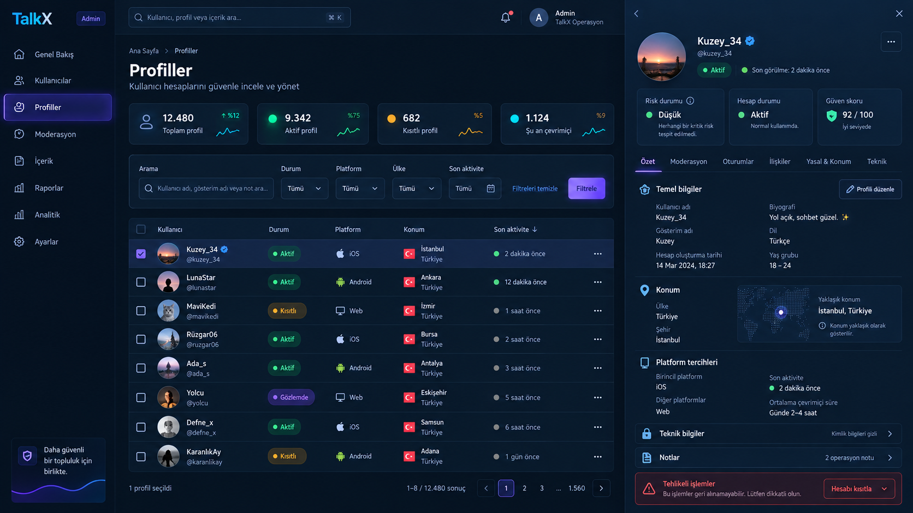
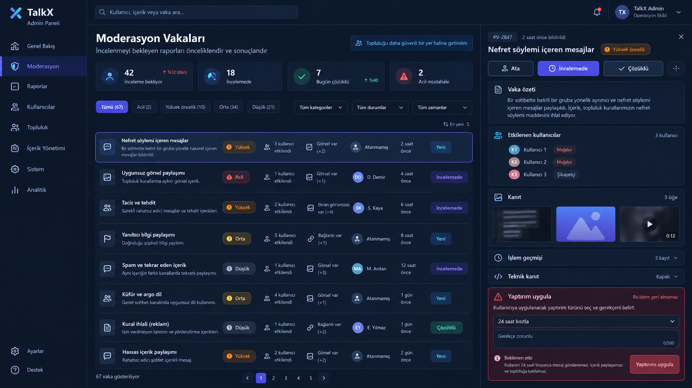
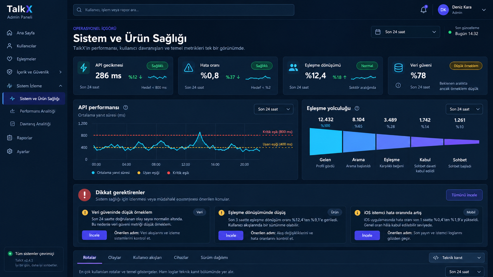

# TalkX Backend Paneli — Tam Ekran İncelemesi ve Yeniden Tasarım Planı V2

Bu dosya, TalkX yönetim panelinin güncel canlı sürümünü ekran ekran inceleyerek kalan görsel ve bilgi mimarisi işlerini tek yerde toplar. Amaç yalnız renkleri veya boşlukları düzeltmek değil; ham veriyi yöneticinin karar verebileceği, güvenli ve tutarlı bir operasyon deneyimine dönüştürmektir.

## İnceleme özeti

- **İnceleme tarihi:** 29 Eylül 2026
- **İncelenen branch:** `sale-release`
- **İncelenen deploy commit'i:** `93e8899`
- **Canlı yüzey:** TalkX Render yönetim paneli
- **Kapsam:** 12 navigasyon ekranı, profil detayı, uygulama raporu detayı, masaüstü yoğun veri görünümü ve dar ekran davranışı
- **Durum:** Uygulama başladı; Paket A ve Paket B kodlandı, görsel ve otomatik kontrollerden geçti
- **Önceki temel:** `../2026-09-28-full-panel-review/ADMIN_PANEL_VISUAL_REVIEW.md`
- **Ortak sözleşme:** `../2026-09-28-full-panel-review/ADMIN_UI_FOUNDATION.md`

> **Gizlilik sınırı:** Canlı Profiller, Profil Detayı, Online, Audit ve rapor ekranları gerçek kullanıcı/cihaz/vaka bilgileri içerdiği için ekran görüntüleri repoya kopyalanmadı. Bu dosyadaki hedef görseller sentetik verilerle üretildi. Canlı ekranlar doğrudan incelendi ve bulgular kişisel veri taşımadan yazıldı.

## Sonuç

`ADM-01` kabuk/navigasyon ve `ADM-02` Genel Bakış doğru yönde uygulanmış durumda. Ana problem, kalan ekranların hâlâ önceki nesil yönetim aracı yaklaşımını kullanmasıdır. Sol navigasyon ve topbar yeni bir ürün hissi verirken içerik alanı çoğu sayfada ham tablo, tek satıra sıkıştırılmış form veya uzun modal olarak kalıyor.

Paneldeki kopukluğun temel nedenleri:

1. **Kabuk ile içerik iki farklı tasarım neslinde.** Sidebar/topbar kontrollü ve markalı; içerik yüzeyleri genel `.panel`, `.table`, `.item` ve `.btn` stillerine bırakılmış.
2. **Ham veri karar bilgisinin önünde.** İngilizce enumlar, JSON payload, UUID, kaynak tablo adları, hata kodları ve teknik durumlar doğrudan ana yüzeyde gösteriliyor.
3. **Detay yapısı bozuk.** Profil ve uygulama raporu detaylarında etiket ile değer arasında görsel ayrım olmadığı için metinler birleşiyor; içerik uzun, iç içe scroll'lu ve görev sırası belirsiz.
4. **Riskli işlemler bağlamsız.** Ban, kalıcı yasak, gölge yasak, silme, hemen gönderme ve yayın benzeri aksiyonlar inceleme akışıyla aynı ağırlıkta duruyor.
5. **Boşluk bilgi mimarisi yerine kullanılıyor.** Kayıt olmayan ekranlarda dev karanlık alan kalıyor; neden, durum, önerilen adım ve zaman bilgisi verilmiyor.
6. **Tablolar bütün ekranlara tek çözüm olarak uygulanıyor.** Online, Audit, Performans, Analitik, Moderasyon ve Yasal içerik farklı görevler olmasına rağmen aynı veri dökümü yaklaşımına sıkıştırılıyor.
7. **Dil ve durum sözleşmesi tamamlanmamış.** `active`, `received`, `requested`, `low_confidence`, `metadata_only` gibi değerler yöneticinin anlayacağı Türkçe duruma çevrilmiyor.

## Korunacaklar

- Sol navigasyonun görev grupları ve gerçek SVG ikonları.
- Topbar'ın sayfa başlığı, kısa amaç metni ve tek yenileme aksiyonu.
- Genel Bakışın bölüm sırası: Genel Bakış → Sistem Sağlığı → Push Teslimatı → Kullanıcı Aktivitesi.
- Koyu TalkX zemini, sakin mor aktif durum, cyan bilgi ve sınırlı durum renkleri.
- URL hash/back-forward davranışı ve mobil drawer erişilebilirliği.
- Mevcut backend endpointleriyle dürüst veri gösterimi; sahte trend veya uydurma skor üretilmemesi.

## V2 ortak sayfa kalıbı

Her sayfa aynı iskeleti kullanacak:

1. **Sayfa başlığı:** amaç, veri tazeliği ve tek ana aksiyon.
2. **Karar özeti:** gerekiyorsa en fazla 2–4 sayı/durum.
3. **Filtre ve kapsam:** görünür etiketler, aktif filtre özeti, temizleme.
4. **Çalışma alanı:** göreve uygun liste, vaka kuyruğu, grafik veya besteci.
5. **Detay katmanı:** sağ drawer/tam ekran sheet; ana sayfayı kapatan uzun genel modal kullanılmaz.
6. **Teknik kanıt:** varsayılan kapalı, maskeli ve ikincil.
7. **Kalıcı sonuç:** başarı/hata/audit referansı yalnız geçici `alert()` veya toast'a bırakılmaz.

## Yeni referans yönleri

### 1. Profiller ve profil detayı

Bu referans Profiller listesi, filtre sistemi, kimlik hücresi, durum gösterimi, detay drawer'ı, sekmeli bilgi mimarisi ve riskli işlem ayrımının hedefidir. Görseldeki sayılar ve kullanıcılar yalnız yerleşim örneğidir; uygulamada gerçek endpoint sözleşmeleri kullanılacaktır.

### 2. Moderasyon vaka çalışma alanı

Kullanıcı Raporları ve Uygulama Raporları aynı görsel vaka diliyle çalışacak; veri kaynakları ve backend akışları ayrı kalabilir. Yaptırım, liste satırındaki üç kırmızı buton yerine bağlam, gerekçe ve etki özeti olan ayrı alanda uygulanacaktır.

### 3. Sistem ve ürün sağlığı

Performans ve Davranış Analitiği tek sayfaya zorla birleştirilmeyecek; aynı özet/grafik/kanıt sistemini kullanacak. Ham zaman serisi ve olay JSON'u ilk görünümden çıkarılacaktır.

### 4. Form, önizleme ve yayın ailesi

Bildirimler ve Yasal Metinler aynı besteci kabuğunu kullanacak: içerik, kapsam/etki, önizleme ve güvenli son işlem birbirinden ayrılacak.

---

## Ekran envanteri ve öncelik

| Kod | Ekran | Güncel ana sorun | Hedef kalıp | Öncelik |
|---|---|---|---|---:|
| ADM2-00 | Ortak içerik sistemi | Yeni kabuk içinde eski panel/table/form dili | Ortak section, card, filter, table, drawer, state sistemi | P0 |
| ADM2-01 | Genel Bakış | Teknik kaynak adları ve düşük örneklem dili hâlâ fazla ham | Yönetici dili + açılır teknik kanıt | P1 |
| ADM2-02 | Profiller | Filtre zayıf, platform pill'i gereksiz uzuyor, durum/konum teknik | Tarama odaklı liste + detay drawer | P0 |
| ADM2-03 | Profil Detayı | Etiket/değer birleşiyor, uzun modal, ham oturum/cihaz verisi | Sekmeli responsive drawer | P0 |
| ADM2-04 | Kullanıcı Raporları | Ham enumlar ve doğrudan üç yaptırım butonu | Vaka kuyruğu + güvenli yaptırım akışı | P0 |
| ADM2-05 | Uygulama Raporları | Liste daha iyi ama detay ham grid ve uzun modal | Vaka özeti + kanıt + geçmiş drawer'ı | P0 |
| ADM2-06 | Yasaklar ve Gölge | Boş sayfa durumu ve geçmiş/aktif ayrımı yok | Yaptırım merkezi | P1 |
| ADM2-07 | Silme Talepleri | İngilizce durum, `0.0s`, zayıf SLA ve empty state | SLA kuyruğu + güvenli karar drawer'ı | P1 |
| ADM2-08 | Bildirimler | Etiketsiz tek satır formlar, hedef/önizleme/etki yok | Bildirim bestecisi | P1 |
| ADM2-09 | Anlık Online | Cihaz ID'si ana tabloda, stale/auto-refresh bağlamı yok | Canlı operasyon özeti | P1 |
| ADM2-10 | Performans | Ham durum satırı ve dakika dakika tablo | Sağlık özeti + grafik + route kanıtı | P1 |
| ADM2-11 | Davranış Analitiği | KPI/funnel tekrar ediyor, dev sıfır tabloları ve raw JSON | Yolculuk/funnel + sapma + kanıt | P1 |
| ADM2-12 | Audit Log | Ham action/entity/payload ve UUID duvarı | İnsan dili aktivite akışı + açılır kanıt | P0 |
| ADM2-13 | Yasal Metinler | Tek dev canlı form, taslak/yayın/diff yok | Belge yayın merkezi | P1 + backend |

---

## ADM2-00 — Ortak içerik sistemi

- **Durum:** Ortak temel uygulandı; kalan ekranlar paket sırasıyla bu sisteme taşınacak
- **Öncelik:** P0
- **Kapsam:** Bütün ekranlar

### Canlı bulgu

Topbar ve sidebar tutarlı olsa da içerik alanında aynı amaç için farklı boşluk, kart, tablo ve buton biçimleri kullanılıyor. Global `table-layout`, `.item`, `.panel` ve `.btn` stilleri görev türünü anlatmıyor. Profil/rapor detayındaki `.item` içinde güçlü etiket ve değer aynı satırda birleşiyor.

### Yapılacak

- `admin-page`, `admin-section`, `summary-card`, `filter-bar`, `data-surface`, `empty-state`, `status-pill`, `detail-drawer`, `evidence-panel`, `danger-zone` ortak sınıfları oluşturulacak.
- Etiket/değer bileşeni iki satırlı olacak; uzun değerler kontrollü kırılacak.
- Ham backend durumları tek bir Türkçe label/ton/ikon map'inden geçecek.
- Native `alert`, `prompt`, genel `confirm` yerine alan doğrulamalı ortak onay akışı kurulacak.
- Mobilde drawer tam ekran sheet; veri listeleri öncelikli kolon veya kart satırı olacak.

### Kabul kriterleri

- Bütün sayfalarda aynı section başlığı, tazelik, boş/hata/loading ve buton hiyerarşisi kullanılır.
- Etiket ile değer hiçbir detay kartında birleşmez.
- Teknik alan adı veya İngilizce enum ana yönetici yüzeyinde görünmez.
- Tehlike rengi yalnız gerçek riskli işlem ve kritik duruma ayrılır.

## ADM2-01 — Genel Bakış son cilası

- **Durum:** Kısmen tamam
- **Öncelik:** P1

### Canlı bulgu

Ana hiyerarşi doğru ve panelin hedef kalitesini gösteriyor. Buna rağmen kart altlarında `PostgreSQL users`, `runtime conversation registry`, `user_reports + support_reports`, `http_request_metrics_minute` gibi implementasyon adları görünür. Gönderim olmayan zaman aralığında `0.0%` değeri, durum `Bilinmiyor` olsa bile ilk bakışta başarısız oran gibi algılanabilir.

### Yapılacak

- Kaynak tablo/registry adları `Teknik ayrıntılar` içine taşınacak.
- Push denemesi yoksa oran yerine `Gönderim yok` kullanılacak.
- Düşük örneklem, veri yok, stale ve servis hatası insan diliyle ayrılacak.
- `Son hesaplama` ile veri penceresi aynı başlık sisteminde gösterilecek.

## ADM2-02 — Profiller listesi

- **Durum:** Uygulandı ve doğrulandı
- **Öncelik:** P0

### Canlı bulgu

- Liste okunabilir hale gelmiş olsa da yalnız arama + sınırlı sıralama sunuyor.
- Platform etiketi kimlik kolonunda yatay olarak gereksiz uzuyor.
- `active`, konum kaynağı ve doğrulama bilgisi teknik dilde.
- Aynı görünümde toplu seçim var fakat seçilmedikçe neden var olduğu anlaşılmıyor.
- `Detay` her satırda tek baskın eylem; durum/risk özeti yok.

### Yeni düzen

- Üstte yalnız yararlı sayılar: toplam, aktif, kısıtlı, son 24 saatte aktif.
- Filtreler: hesap durumu, yaptırım, platform, ülke, son aktivite.
- Kimlik hücresi: görünen ad + kullanıcı adı + kompakt platform ikonu.
- Satır sonu: üç nokta menüsü; ana tıklama detay drawer'ını açar.
- Toplu araç çubuğu yalnız seçim yapıldığında görünür.

### Kabul kriterleri

- 200% zoom ve 390 px görünümde isimler harf harf bölünmez.
- Platform etiketi içerik genişliğini aşmaz.
- Filtre özeti, sonuç aralığı ve temizleme eylemi görünürdür.
- Hassas/teknik konum kaynağı ana satırda değil ayrıntıda kalır.

## ADM2-03 — Profil Detayı

- **Durum:** Uygulandı ve doğrulandı
- **Öncelik:** P0

### Canlı bulgu

Profil detayı paneldeki en bozuk yüzeylerden biri:

- `Kullanıcıdeğer`, `Görünen İsimdeğer`, `Durumactive` gibi etiket/değer birleşmeleri var.
- Uzun modal içinde ayrıca iç scroll bulunuyor; bağlam ve ana aksiyon kayboluyor.
- Oturumlar, push cihazları, yasal kabul, konum, arkadaşlık ve engeller aynı uzun akışta.
- İngilizce teknik açıklamalar ve cihaz kimliği biçimleri ana içerikte.
- Arkadaş ekleme/kaldırma gibi yazma işlemleri profil incelemesiyle aynı yüzeyde.

### Yeni düzen

- Masaüstünde sağ drawer (`min(720px, 48vw)`), mobilde tam ekran sheet.
- Sticky başlık: avatar/baş harf, görünen ad, kullanıcı adı, hesap durumu, son aktivite, risk özeti.
- Sekmeler: Özet, Moderasyon, Oturumlar, İlişkiler, Yasal & Konum, Teknik.
- Teknik cihaz/IP/session değerleri maskeli ve kapalı kanıt katmanında.
- Riskli/yazma işlemleri drawer altındaki ayrı `Tehlikeli işlemler` alanında.

### Kabul kriterleri

- Yönetici hesap durumu, son aktivite ve risk özetini beş saniyede bulur.
- Bölümler bağımsız loading/error/empty durumuna sahiptir.
- Drawer kapanınca liste filtresi ve scroll konumu korunur.
- Tam tanımlayıcılar varsayılan görünümde bulunmaz.

## ADM2-04 — Kullanıcı Raporları

- **Durum:** Acil revizyon
- **Öncelik:** P0

### Canlı bulgu

`other`, `metadata_only`, `received` gibi enumlar doğrudan görünür. Her satırda `24s`, `Kalıcı`, `Gölge` aksiyonları bulunuyor; vaka özeti ve kanıt incelenmeden yaptırım uygulanabiliyor. Rapor yaşı, tekrar sayısı, sahip ve son işlem görünmüyor.

### Yeni düzen

- İnsan diliyle vaka başlığı ve kategori.
- Öncelik, tekrar/etki, kanıt durumu, yaş, sahip ve workflow durumu.
- Satırda yaptırım yok; seçilen vaka detayında kanıt ve geçmiş sonrası işlem.
- Profil detayıyla doğrudan fakat kontrollü geçiş.

## ADM2-05 — Uygulama Raporları ve Detayı

- **Durum:** Acil revizyon
- **Öncelik:** P0

### Canlı bulgu

Liste önceki sürüme göre daha anlamlıdır; sorun, detay modalında tekrar ortaya çıkıyor. Rapor ID, konu, workflow, öncelik, sahip, cihaz, ağ, app sürümü ve hata kodu aynı ağırlıkta grid'e dökülüyor. Etiket/değer birleşiyor. Medya ile karar geçmişi sayfanın altına gömülüyor.

### Yeni düzen

- Sağ drawer: Vaka özeti, kullanıcı bildirimi, kanıt, ortam özeti, geçmiş.
- Rapor ID/teknik metadata açılır kanıta taşınır.
- `Durum / Not Güncelle` prompt zinciri yerine görünür workflow formu.
- Arşivleme ayrı riskli işlem ve gerekçeli onay.

## ADM2-06 — Yasaklar ve Gölge

- **Durum:** Revizyon bekliyor
- **Öncelik:** P1

### Canlı bulgu

Kayıt yokken yalnız `Kayıt bulunamadı` metni ve büyük boş alan görünür. Aktif/geçmiş, süreli/süresiz, normal/gölge yaptırım ayrımı ve filtreleri yok.

### Yeni düzen

- Üst özet: aktif yaptırım, süresi dolacak, gölge, son 24 saat kaldırılan.
- Sekmeler: Aktif / Geçmiş.
- Filtre: tür, süre, uygulayan, tarih.
- Empty state: sistemde aktif yaptırım olmadığını ve son yenileme zamanını açıklar.
- Kaldırma işlemi etki + gerekçe + audit onayıyla çalışır.

## ADM2-07 — Silme Talepleri

- **Durum:** Revizyon bekliyor
- **Öncelik:** P1

### Canlı bulgu

Filtrede `requested/rejected/completed` enumları, metriklerde `0.0s` ve boş listede zayıf tek satır bulunuyor. SLA aşımı sayı olarak var fakat risk ve sonraki aksiyon anlatılmıyor.

### Yeni düzen

- Türkçe durumlar: Bekliyor, Reddedildi, Tamamlandı.
- Saat birimi `0 saat` veya veri yok biçiminde dürüst gösterilir.
- Talep yaşı, SLA kalan/aşım, inceleyen, son işlem ve kanıt özeti.
- Kalıcı silme yalnız detay drawer'ında kontrol listesi ve exact confirmation ile.

## ADM2-08 — Bildirimler

- **Durum:** Revizyon bekliyor
- **Öncelik:** P1

### Canlı bulgu

Anlık gönderim ve yeni plan alanları etiketsiz tek satır input dizisidir. Süre alanının ne olduğu yalnız mevcut değer üzerinden tahmin edilir. Hedef kitle, dil, tahmini alıcı, cihaz önizlemesi ve gönderim sonucu özeti yoktur. Düzenle, pasifleştir, şimdi çalıştır ve sil aynı satırda sıkışır.

### Yeni düzen

- Sol: içerik bestecisi; TR/EN başlık ve metin, karakter sayacı.
- Orta: hedef, zaman, süre, timezone ve tahmini alıcı.
- Sağ: Android/iOS bildirim önizlemesi ve etki özeti.
- `Taslak/Plan Kaydet` ile `Şimdi Gönder` ayrılır.
- Plan listesinde normal eylemler menüde; silme ayrı onayda.

### Backend bağımlılığı

TR/EN varyantı, hedef segmenti ve kesin alıcı sayımı mevcut sözleşmede yoksa ayrı backend işi olarak uygulanmalıdır; yalnız görsel taklit yapılmaz.

## ADM2-09 — Anlık Online

- **Durum:** Revizyon bekliyor
- **Öncelik:** P1

### Canlı bulgu

İki özet sayıdan sonra ham tablo geliyor. Tam cihaz kimliği ana satırda yer alıyor. Otomatik yenileme, son snapshot, stale durumu veya bağlantı kalitesi anlatılmıyor.

### Yeni düzen

- Canlı/stale etiketi ve son snapshot zamanı.
- Online profil, bağlantı, platform dağılımı ve ortalama bağlı kalma özeti.
- Liste: kimlik, platform/dil, bağlantı yaşı; cihaz kimliği teknik detayda maskeli.
- Otomatik yenileme seçimi odak/scroll'u bozmadan çalışır.

## ADM2-10 — Performans

- **Durum:** Revizyon bekliyor
- **Öncelik:** P1

### Canlı bulgu

`low_confidence`, `fresh`, `low` gibi durumlar tek ham satırda. P50/P95/P99 aynı kartta sıkışıyor. Ana içerik dakika dakika tablo olduğu için genel sağlık ve sapma okunmuyor. Düşük örneklemde neden yüzdelik üretilmediği anlaşılmıyor.

### Yeni düzen

- Sağlık kartları: trafik, hata, P95, veri güveni.
- Gerçek zaman serisi grafik ve eşik çizgileri.
- `Dikkat gerektirenler`: ne oldu, etki, önerilen kontrol.
- Route etkisi özet listesi; ham istekler teknik kanıtta.
- Düşük örneklem insan dilinde ve örnek sayısıyla açıklanır.

## ADM2-11 — Davranış Analitiği

- **Durum:** Revizyon bekliyor
- **Öncelik:** P1

### Canlı bulgu

Sekiz KPI kartı ve altı funnel kartı aynı sayıları tekrar ediyor. Trend, event dağılımı, platform, kullanıcı davranışı ve son olaylar art arda ham tablolar halinde. Düşük trafikte ekran sıfır duvarına dönüşüyor. Son olaylarda JSON ve teknik event adları ana yüzeyde.

### Yeni düzen

- Ana yolculuk: Gelen → Arama → Eşleşme → Kabul → Sohbet.
- Her adımda sayı, oran, önceki döneme göre gerçek karşılaştırma ve güven.
- Trend grafik; sıfır dolu satırlar yerine anlamlı zaman aralığı.
- Sapmalar ve kayıp noktaları için açıklama.
- Event adı/JSON yalnız teknik kanıt drawer'ında.
- Kullanıcı bazlı drilldown yalnız gerekli role ve maskeli kimlikle.

## ADM2-12 — Audit Log

- **Durum:** Acil revizyon
- **Öncelik:** P0

### Canlı bulgu

Ekran şu an `DELETION_APPROVE`, `FRIEND_ADD`, entity adı, UUID ve JSON payload duvarıdır. Payload kolonundaki uzun metin satır yüksekliğini büyütür, taramayı zorlaştırır ve gereksiz tanımlayıcıları ana yüzeye taşır.

### Yeni düzen

- İnsan dili aktivite cümlesi: aktör + eylem + hedef türü + sonuç + zaman.
- Filtreler: aktör, eylem ailesi, hedef türü, sonuç, tarih.
- Varsayılan satırda sanitize özet; ham payload kapalı teknik kanıtta.
- UUID kopyalama gerekliyse ikincil detayda ve maskeli başlangıçla.
- İlgili vaka/profil/yayın kaydına kontrollü geçiş.

## ADM2-13 — Yasal Metinler

- **Durum:** Revizyon + backend modeli bekliyor
- **Öncelik:** P1

### Canlı bulgu

Footer metinleri, URL'ler, sürümler ve altı uzun içerik alanı tek sayfada aynı anda açık. Yönetici hangi belgenin canlı, hangisinin değişmiş olduğunu göremiyor. Tek kaydetme eylemi yayın etkisini, yeniden kabul gereksinimini ve diff'i göstermiyor.

### Yeni düzen

- Açılış ekranı: Privacy, Terms, Child Safety, Footer/Linkler durum kartları.
- Bir seferde tek belge editörü; TR/EN sekme veya yan yana karşılaştırma.
- Taslak kaydet, önizle, diff, yayın etkisi ve ayrı yayın onayı.
- Sürüm değişikliği/reaccept etkisi zorunlu karar alanı.
- Değişmez yayın snapshot'ı ve geçmiş.

### Backend bağımlılığı

Taslak/yayın/snapshot/rollback ve eşzamanlı düzenleme koruması veri modeli gerektirir. Bu işler yalnız CSS/HTML revizyonu olarak kapatılamaz.

---

## Uygulama sırası

Bu sıra, dashboard'a dokunmadan kalan ekranları aynı kalite seviyesine taşır:

1. [x] **Paket A — ADM2-00 ortak içerik sistemi:** section, durum, tablo/list, drawer, kanıt ve danger-zone temeli.
2. [x] **Paket B — ADM2-02/03 Profiller:** liste + profil detay drawer'ı; etiket/değer ve hassas veri sorunu kapatıldı.
3. [ ] **Paket C — ADM2-04/05/06 Moderasyon:** kullanıcı raporu, uygulama raporu ve yaptırım merkezi.
4. [ ] **Paket D — ADM2-07/09/12 Operasyon kanıtı:** silme talepleri, online ve audit.
5. [ ] **Paket E — ADM2-10/11 Sistem içgörüsü:** performans ve davranış analitiği.
6. [ ] **Paket F — ADM2-08 Bildirim bestecisi:** önce mevcut sözleşmeyle görsel temel, sonra onaylı backend hedef/dil işi.
7. [ ] **Paket G — ADM2-13 Yasal yayın merkezi:** backend taslak/yayın modeliyle birlikte.
8. [ ] **Paket H — ADM2-01 Genel Bakış cilası ve tam regresyon:** teknik kaynak dili, no-data ve son görsel bütünlük.

### Uygulama kaydı — Paket A + Paket B

- Ortak section, özet kartı, durum/empty state, status pill, iki satırlı etiket-değer, drawer ve danger-zone görsel sistemi eklendi.
- Profiller görünümü karar odaklı özet, kompakt platform etiketi, Türkçe hesap durumu, güvenli konum özeti ve açıklayıcı sonuç/pagination diliyle yenilendi.
- Profil detayı uzun modalden çıkarılıp altı sekmeli sağ drawer'a; mobilde tam ekran sheet'e taşındı.
- Oturum/push/konum/yasal/ilişki/moderasyon/teknik bilgiler ayrıldı; cihaz ve kayıt tanımlayıcıları varsayılan görünümde maskelendi.
- Mevcut profil endpoint'i alan bazlı sunucu filtresi sağlamadığı için sahte yalnız-sayfa filtresi eklenmedi; arama, sıralama ve sayfalama gerçek toplam üzerinden çalışmaya devam ediyor.
- Doğrulama: masaüstü ve 390×844 responsive kontrolü, sıfır yatay sayfa/drawer taşması, drawer odak dönüşü ve Escape kapanışı, altı sekmenin tamamı, temiz tarayıcı konsolu, `108/108` backend testi ve kalite kapısı.

## Paket sınırları

- Her paket kendi otomatik testini ve masaüstü/mobil görsel QA'ini tamamlamadan sonraki pakete geçmez.
- Bir pakette davranış sözleşmesi eksikse sahte UI yapılmaz; backend bağımlılığı ayrı commit ve testle tamamlanır.
- `admin.html` tek dosya kalacaksa bile render yardımcıları ve sınıf isimleri ekranlar arası ortaklaştırılır; kopyala-yapıştır stiller büyütülmez.
- Mevcut endpoint alanları kaldırılmaz; yeni görünüm önce uyumluluk katmanıyla çalışır.

## Otomatik doğrulama

- [x] `npm test` tam geçer. (`108/108`)
- [x] `npm run quality:all` geçer. (kritik paket `60/60`; yüksek/kritik güvenlik kaydı yok)
- [ ] Admin HTML kaynak/regresyon testleri ortak drawer/state/table sözleşmesini korur.
- [ ] Ham enum/JSON/teknik kaynak adlarının ana yüzeye sızmasını yakalayan testler vardır.
- [ ] Riskli işlemler gerekçe + açık hedef + audit sonucu olmadan çalışmaz.

## Hızlı manuel kapanış checklist'i

### Masaüstü

- [ ] Her sayfada başlık, özet, filtre ve çalışma alanı aynı hiyerarşidedir.
- [ ] İçerik dev boş panel veya sınırsız uzun ham tabloya dönüşmez.
- [ ] Drawer açıldığında ana liste bağlamı ve scroll'u korunur.
- [ ] Etiket ve değerler görsel olarak ayrıdır.

### Mobil / dar ekran

- [ ] 390 px ve 320 px'de sayfa genelinde yatay taşma yoktur.
- [ ] Drawer tam ekran sheet olur; başlık ve kapatma sabit kalır.
- [ ] Tablolar öncelikli kolon/kart modeline geçer veya kendi kontrollü alanında kayar.
- [ ] Riskli işlem alanı içeriği kapatmaz.

### Veri ve durum dürüstlüğü

- [ ] `0`, veri yok, düşük örneklem, stale, partial ve error ayrıdır.
- [ ] İngilizce enum veya ham backend hata mesajı yöneticiye doğrudan gösterilmez.
- [ ] JSON, UUID, session/device ID ve kaynak tablo adı varsayılan görünümde değildir.
- [ ] Teknik kanıt maskeli ve varsayılan kapalıdır.

### Etkileşim ve erişilebilirlik

- [ ] Yalnız klavye ile sayfa, filtre, drawer ve onay akışları kullanılabilir.
- [ ] Focus görünür; drawer focus trap ve Escape çalışır.
- [ ] Durum yalnız renkle anlatılmaz.
- [ ] Riskli eylemin buton metni hedef ve fiili açıkça söyler.

### Son regresyon

- [ ] Bütün 12 navigasyon hedefi açılır ve geri/ileri çalışır.
- [ ] Profil, kullanıcı raporu ve uygulama raporu detayları doğru kaydı açar.
- [ ] Canlı veri ile UI özeti endpoint değerleri karşılaştırılır.
- [ ] Tarayıcı konsolunda uygulama kaynaklı yeni hata yoktur.
- [ ] Canlı QA görüntülerinde gerçek kişisel veri repoya kaydedilmez.

## Kodlama başlamadan önce hazır kararlar

- Profil ve vaka detayları **sağ drawer**, mobilde **tam ekran sheet** olacak.
- Kullanıcı ve uygulama raporları backendde ayrı kalabilir; görsel olarak aynı **vaka çalışma alanı** kullanılacak.
- Audit payload ve davranış event JSON'u varsayılan ana tablodan çıkarılacak.
- Bildirim ve yasal içerik ekranı ortak **besteci + önizleme + etki** ailesini kullanacak.
- Genel Bakışın mevcut kabuk ve bölüm dili korunacak; alt ekranlar bu seviyeye taşınacak.
- Sahte skor, sahte trend veya mevcut olmayan backend yeteneği görsel amaçla üretime eklenmeyecek.

## Kapanış

- **İnceleme sonucu:** Kabuk ve dashboard korunacak; kalan ekranların tamamı ortak veri, detay, vaka, besteci ve kanıt kalıplarıyla yeniden ele alınmalı.
- **İlk uygulanacak paket:** Paket A — ADM2-00 ortak içerik sistemi.
- **İlk görünür ürün paketi:** Paket B — Profiller ve Profil Detayı.
- **Deploy kararı:** Bu dosya planlama/inceleme çıktısıdır; ürün kodu değiştirilmedi.
